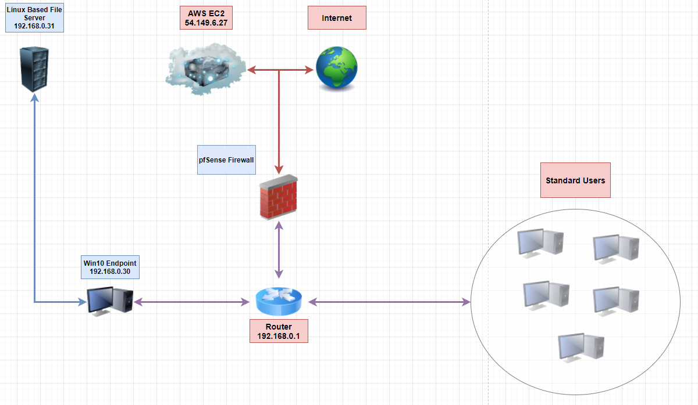

# Team HighFlying

## What We Offer

### This team brings together years of experience. Josh specializes in networking and code, while Victor prefers the research aspect of things.  Marcus is the cloud expert and Harrison is the customer service extraordinaire. 

### The diverse skills we bring to the table ensures our projects can meet the demands of all our clients. As a professional group we understand security and networking is an ever changing environment and strive on a daily basis to improve our skills. We each identify areas of weakness and work to improve those. 

    - Marcus works on the entire spectrum all the time.
    - Victor spends time honing his craft.
    - Josh depends on his adept decision making skills and works to improve them.
    - Harrison works tirelessly to ensure his personality invites engagement and professionalism.

### Every day we have a standup meeting that puts us all on the same page. Meeting customer goals is the goal. 

## Conflict Resolution

If conflict arises we have a solid team in place.  Conflicts are approached from a direction of understanding. At times people may say or do things that offend another.  These will be talked through as group. Understanding, compassion and grace will be the goal of resolution. 

All team members will be encouraged to speak up without bias. We are a group of individuals with varied backgrounds and experience. This is what makes us strong. In practice it will be the purpose of the morning meeting to ensure that all members are on the same page and feel included in the process. The team will play to each others strengths and envolve others where they may be weak to ensure everyone succeeds.  

Should a member not be contributing, which has never happened in our history, all members will sit with a 3rd party to ensure proper resolusion.

Flexibility is key. Not just in technology, but in life.  All members will be afforded the opportunity to contribute on their schedule.

## Communication

This is key. A lot of teams fail when communication is lacking. We will meet every morning at 9am and again at 4pm. That is not to say there will not be collaboration in the mean time. We will meet every morning at 9pm and again at 430pm. All members will be available on discord and slack throughout the day. Breaks will be taken as needed. In the unlikely event we fall behind, just kidding, we wont.

We foster a community of inclusion. It is the goal of all those involved to ensure everyone is comfortable.

Tasks will be assigned by group discussion with the goal of playing to everyones strength. Members that are weak in an area can pair up with a partner to get a better understanding of the task. 

We will be using Google docs, discord and github to manage the project. 

All presentation and preperation docs as well as scripts will live on github.

All team members will pull at morning standup and push at the end of collaborative work for the day.

All pull requests will go through 2 seperate approvals to ensure work flow on github is seamless. 

System Selection:

- Linux-Based File Server
- Windows 10 Machines
- Windows Server 2016
- Lightsail
- AWS EC2
- VScode 
- Gmail
- Mozilla Thunderbird
- PowerShell

Items may be added to the list as project is underway.

## Minimum Viable Product

At a bare minimum there will be a Linux based file server, Windows Server 2016, and Windows 10 outfitted with Gmail accounts on a Mozilla Thunderbird email client all integrated for maximum efficiency.

## Project Topography

